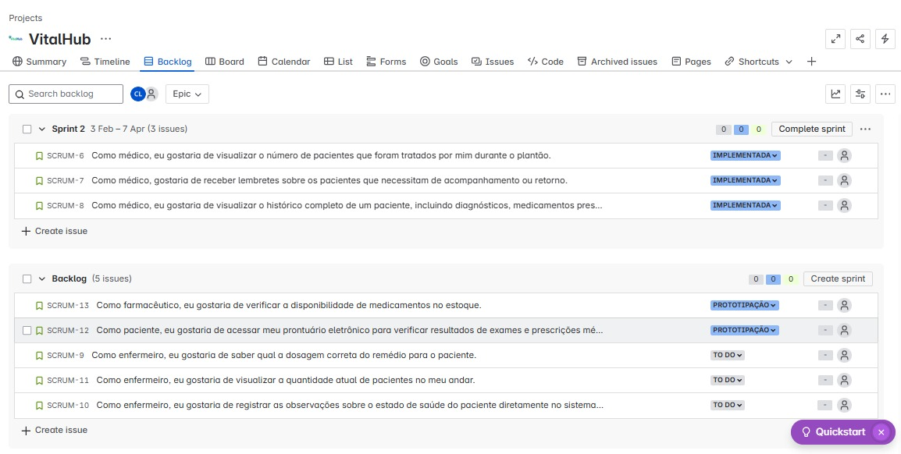
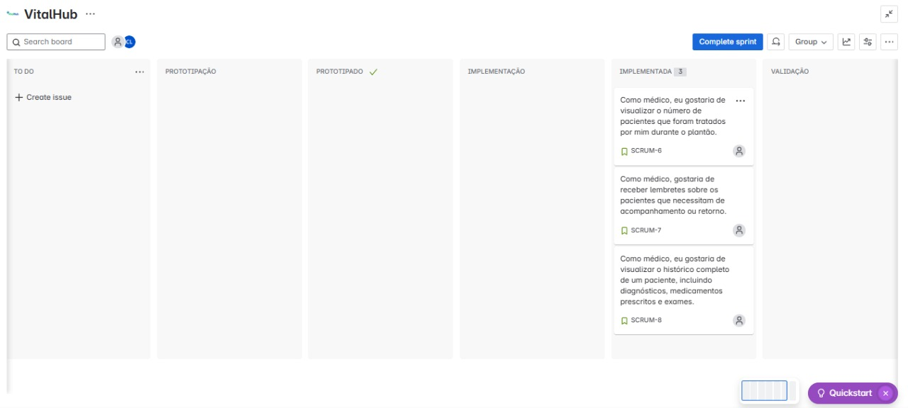

# VitalHub 🏥
O que é o VitalHub? É a plataforma digital que auxilia a gestão e comunicação dentro do ambiente hospitalar. Seu principal objetivo é facilitar a troca de informações essenciais entre todos os usuários do sistema, incluindo pacientes, médicos, enfermeiros e outros profissionais de saúde.

# Tecnologias presentes 💻

**Framework**: 

**Linguagens**: 

**Front-end**: 

# Equipe 🫱🏼‍🫲🏽

<ul>
  <li>
    <a href="https://github.com/clarissalopes6">Clarissa Lopes</a> col@cesar.school
  </li>
  <li>
    <a href="https://github.com/pdilha">Rafael Padilha</a> rpfs@cesar.school
  </li>
   <li>
    <a href="https://github.com/PedroGarcez13">Pedro Garcez</a> pastdcg@cesar.school 
  </li>
  <li>
    <a href="https://github.com/fdaniel27">Daniel Alves</a> dfa2@cesar.school 
  </li>
  <li>
    <a href="https://github.com/DaviFernandoMatias">Davi Fernando</a> dfms3@cesar.school
    </li>
</ul>

# Links 🔗

[Jira](https://projeto-fds.atlassian.net/jira/software/projects/SCRUM/boards/1?atlOrigin=eyJpIjoiMWNjYzQ2YTM4N2Y5NDVjMDgxNGViZjBlM2M2NGE4NTgiLCJwIjoiaiJ9)

[Protótipo LoFi Figma](https://www.figma.com/design/ygGW6Qv3CceK2DXEr2MQZ7/Untitled?node-id=0-1)

[Deployment](https://vitalhub.azurewebsites.net/)

# Entregas 📃

Entrega 1

 

**Historias**
 
Foram definidas oito histórias de usuário para aprimorar a compreensão do futuro produto e garantir que ele atenda às devidas expectativas. Cada história foi detalhada com três cenários distintos, validados por meio da metodologia BDD, utilizando a estrutura Dado - Quando - Então. Esses cenários ajudam a explorar diferentes situações, desde fluxos ideais até possíveis falhas, garantindo uma cobertura abrangente dos requisitos.

As histórias e seus respectivos cenários podem ser acessados e revisados no seguinte documento: [Histórias de Usuário](https://docs.google.com/document/d/1xbqlwoUSrIXnL55CU6QYgMa45vtAQsGyyCIAc9FuHFs/edit?usp=sharing).

**Backlog**

**Painel**

**Sketches do Protótipo Lo-Fi**
 
Disponível através do [Figma](https://www.figma.com/design/ygGW6Qv3CceK2DXEr2MQZ7/Untitled?node-id=0-1&p=f).
 

**ScreenCast**
 
Disponível no [YouTube](https://youtu.be/6gyYWU2fwVU)

Entrega 2

 

**Programação em par**
 
[Relatório da programação em par](https://docs.google.com/document/d/16q4cl490-iFpH92nKSfsmy6rHDmawF0KhlcuTn_wYzs/edit?usp=sharing)

Plataforma de comunicação:
 

**2º Sprint Jira**

**BackLog**

**Painel**

**Screencast**

[Link Screen Cast Entrega 2](https://youtu.be/8dxMvll2nRw)

[Link do deployment](https://vitalhub.azurewebsites.net/)

Entrega 3

**Programação em par atualizada**
[Relatório PP](https://docs.google.com/document/d/16q4cl490-iFpH92nKSfsmy6rHDmawF0KhlcuTn_wYzs/edit?usp=sharing)

**Link Lo-Fi atualizado**
[Protótipo LoFi Figma](https://www.figma.com/design/ygGW6Qv3CceK2DXEr2MQZ7/Untitled?node-id=0-1)

**Screencast Figma**
[Screencast](https://youtu.be/JMZyG5xlCZs?si=rkRnmbLdA_4Bx40O)

**Bug Tracker**

